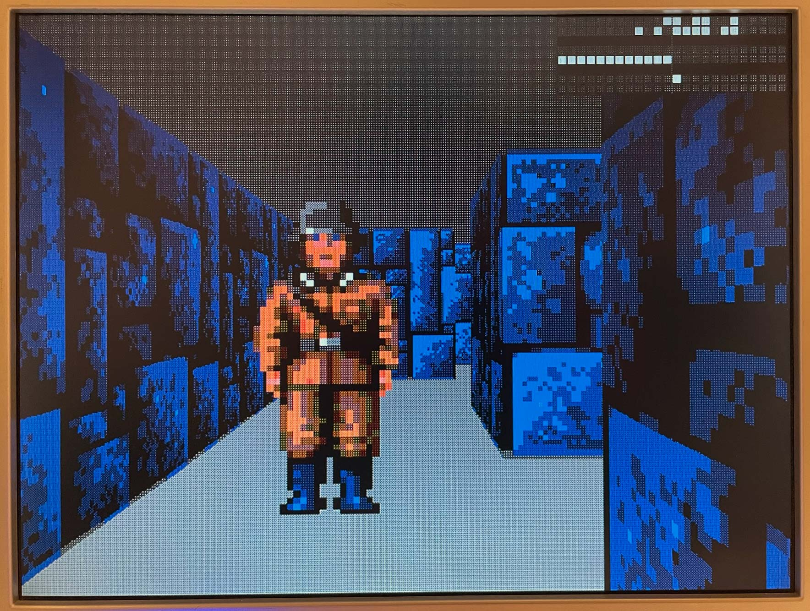

<!--
# SPDX-FileCopyrightText: 2023 Anton Maurovic <anton@maurovic.com>
#
# Licensed under the Apache License, Version 2.0 (the "License");
# you may not use this file except in compliance with the License.
# You may obtain a copy of the License at
#
#      http://www.apache.org/licenses/LICENSE-2.0
#
# Unless required by applicable law or agreed to in writing, software
# distributed under the License is distributed on an "AS IS" BASIS,
# WITHOUT WARRANTIES OR CONDITIONS OF ANY KIND, either express or implied.
# See the License for the specific language governing permissions and
# limitations under the License.
# SPDX-License-Identifier: Apache-2.0
-->

[](https://opensource.org/licenses/Apache-2.0)

# Raybox

This is the start of a Verilog-based ray casting VGA renderer (i.e. "Wolf3D-style" game).

Below is a crappy animated GIF before wall textures were implemented. This doesn't do it justice; running on the FPGA, it is super smooth (60FPS) and clean:


Running on an FPGA, showing 64x64 wall textures with RGB222 colour, but actually outputting only RGB111 to the monitor and using a 2x2 ordered dither:



# License

This repo is licensed with [Apache 2.0](LICENSE), except for image files found in [`assets/`](./assets/) which
are reduced-quality versions of those created by id Software for the 1992 game, "Wolfenstein 3D",
and likely remain the property of ZeniMax Media.


# Targeting OpenLane and Caravel

More to come in this section. I did start this design with the intent of trying to get it onto a
Google-sponsored Skywater (sky130) Open MPW shuttle, to be made into an ASIC. I'm in the process
of seeing how feasible it is to get it synthesised with OpenLane and then in Caravel.

I've got an OpenLane [`config.json`](./config.json) file in the root directory, and some OpenLane-specific
definitions in [`openlane/raybox_target_defs.v`](./openlane/raybox_target_defs.v).

I haven't yet got it to synthesise, though I've made a little progress.


# Hardware

**SCHEMATIC TBD**

Key parts:
*   25.175MHz clock source (though 25.000MHz is good enough).
*   VGA connector: HSYNC and VSYNC via 100&ohm; resistors and R, G, B each via 270&ohm; resistors
    (assuming 3.3V outputs rather than 5V).

# Visual simulation with Verilator

## Setting up under Windows

**These instructions are tested on Windows Home 11 64-bit,** version 22H2 build 22621.1555.
The instructions are based on information from [here](https://code.visualstudio.com/docs/cpp/config-mingw)
and [here](https://spinalhdl.github.io/SpinalDoc-RTD/dev/SpinalHDL/Simulation/install/Verilator.html#windows).

1.  Install VSCode.
2.  In VSCode, install the C/C++ extension, the C/C++ Extension Pack, and the Makefile Tools extension.
3.  Install [MSYS2](https://www.msys2.org/)
    1.  Download and run the installer, typically named something like `msys2-x86_64-20230318.exe`.
    2.  I accepted the defaults, which included the path `C:\msys64`.
    3.  Assuming you leave "Run MSYS2 now" ticked, when you click "Finish" it should pop up a terminal
        (which is `C:\msys64\usr\bin\mintty.exe` for me).
    4.  This should include the `pacman` package manager, and you can run `pacman --version` to verify.
5.  In the MSYS2 terminal (i.e. mintty), sync/update/upgrade packages with: `pacman -Syuu`
    *   Let it close the terminal when it wants to.
6.  Add these to your Windows PATH: `C:\msys64\usr\bin` and `C:\msys64\mingw64\bin` (which will be populated with installed files later).
7.  Run `mintty` (either via Windows "Run" or a fresh command prompt that has loaded the new PATH). Carry on in the terminal...
8.  Run `pacman -Syuu` again.
9.  Install mingw64 toolchain stuff: `pacman -S --needed base-devel mingw-w64-x86_64-toolchain`
    *   Hit <kbd>ENTER</kbd> to select all.
10. The installed packages should allow us to run `gcc --version` and `make --version`, *including* (I think) from both mintty and the Windows Command prompt.
11. Install Verilator. There are a few different ways to do this. You *could* [build the latest version from source](https://gist.github.com/sgherbst/036456f807dc8aa84ffb2493d1536afd) but I chose to do the following to stick with something close to 4.227 (in this case 4.228):
    1.  `pacman -U https://repo.msys2.org/mingw/x86_64/mingw-w64-x86_64-verilator-4.228-1-any.pkg.tar.zst`
    2.  Run `verilator --version` to hopefully reveal 4.228
12. Install SDL2 stuff:
    ```bash
    pacman -S git mingw64/mingw-w64-x86_64-SDL2 mingw64/mingw-w64-x86_64-SDL2_image mingw64/mingw-w64-x86_64-SDL2_ttf
    ```

When opening this project in VSCode, it should hopefully now be possible to open the "Makefile"
tool button (not the file) in the left-hand toolbox, click "Build target:" and select (say) `clean_sim`.
After that, click the play/run button to do the build and see it in action. Note that I've found it
to be quite slow natively under Windows, for some reason (maybe because of Verilator or how SDL2
is working), when running it on the same machine inside a Linux VM is about 3 times faster.


## Setting up under Linux

**These instructions are tested with Ubuntu 20.04 LTS,** but are not yet complete because I'm using
a VM that came preloaded with the build tools and Verilator v4.227.

Make sure SDL2 dev packages are installed:
```bash
sudo apt-get update
sudo apt install libsdl2-dev libsdl2-ttf-dev
```

## Building and running

After setup above has been followed, hopefully you can run the following and it
will build and run the simulator, popping up a window that shows the game in action.
```bash
make clean sim
```

You can also simulate with various init states, too:
```bash
# Each of these builds and simulates, with all unassigned bits starting at...
make clean sim          # ...0
make clean sim_ones     # ...1
make clean sim_seed     # ...predictable random values based on SEED (set in Makefile or overridden via command-line)
make clean sim_random   # ...unpredictable random values each time. 
```

**Reset** is not asserted automatically at the start of simulation, so you'd probably
want to hold down the `R` key for a few frames.

You should then get this:


**NOTES** about what you see in the screenshot above:
*   This is tinted to be brighter than it might actually appear on a VGA display.
    That's because the region that gets rendered
    between SDL refreshes gets its lower bits set to visually show what's being updated
    each time. To toggle this, use the <kbd>H</kbd> key.
*   Regions outside the main display area are typically called "overscan" and allow us
    to visualise the "front porch", "sync", and "back porch" signals for each of
    HSYNC (red) and VSYNC (blue).
*   Regions even further outside this (seen as black to the right
    and at the bottom) should not get any video signal crossing into them, except
    maybe during the simulator's initial attempt to lock on to the video signal.
    Anything that DOES make it into this region should decay back to black after a short while.
*   Faint horizontal and vertical lines are showing what a VGA monitor would probably sense
    as the actual exact visible area of the display.
*   The white squares in the top-right corner visualise the internal binary state of key
    position/direction vectors.

**Don't** expect this to run very fast in simulation. On a Core i7-12700H it runs at about
45% of realtime. On a Core i7-7700 it runs at about 10% of realtime.


## Simulator Hotkeys

**Simulation controls**: Key presses that change the state of the simulator...

| Key           | Function |
|---------------|----------|
| Space         | Pause simulator |
| G             | Toggle extra guides overlay |
| H             | Toggle refresh highlight |
| Q or Escape   | Quit     |
| V             | Toggle VSYNC logging |
| X             | Turn on eXamine mode: Pause simulator if last frame had any tone generation |
| S             | Step-examine: Unpause, but with examine mode on again |
| F             | NOT IMPLEMENTED: Step by 1 full frame |
| I             | Print out a snapshot of the design's current internal vector values |
| Shift + I     | As above, but pauses immediately upon the snapshot printout |
| O (not zero)  | Toggle Override Vectors mode (see below) |
| + (Keypad)    | Increase refresh period by 1000 cycles |
| - (Keypad)    | Decrease refresh period by 1000 cycles |
| 1             | Refresh after every pixel (VERY slow) |
| 8             | Refresh every 8 pixels (quite slow, easier to see and review) |
| 2             | Refresh after every line |
| 3             | Refresh after every 10 lines |
| 4             | Refresh after every 80 lines |
| 5             | Refresh exactly on every frame |
| 6             | Refresh exactly every 3 frames |
| 9             | Refresh after every 100 pixels (better for observing repaint within frames) |
| F12           | Toggle mouse capture |
| Page Up       | Increase movement speed multiplier (initially 1.0) by 10% |
| Page Down     | Decrease movement speed multiplier by 10% |

**Mouse capture** is on by default in Windows, and off by default in Linux. When ON,
the mouse pointer is hidden and mouse events are all sent to the sim window. When OFF,
the mouse pointer is released. If mouse capture and Override Vectors mode are both on
at the same time, the mouse left/right movement will rotate the view (like any modern FPS).
**The reason mouse capture is NOT on by default in Linux** is that if you are running the sim
inside a VM, you *might* get completely wacky mouse movements (probably due to a combination
of an SDL2 bug and the "tablet style" mouse movements that VirtualBox sends to the
Linux desktop).

**Examine mode** is currently programmed to help observe what happens with tone generation,
though this is as yet unused in this design. Use this as an example for other testing you
want to do. The current implementation does the following:
1.  You can hit X to turn on examine mode.
2.  As soon as a frame completes that included the speaker being turned on, go into PAUSE.
3.  You can either just resume with <kbd>Space</kbd>, or step through each subsequent examine trigger with S.

**Override Vectors mode** while active will allow the simulator to decide directly what the
playerX/Y, facingX/Y, and vplaneX/Y vectors are, i.e. for each refresh it calculates values
for these and writes them directly to the design, hence becoming responsible for both motion
and rotation. This allows for potentially more sophisticated control instead of just relying
on whatever motion control and animation the design itself can do. **NOTE:** While this mode
is active, the function of the arrow keys changes from what is documented below; they instead
become rotation controls.

**Signal controls**: Key state directly drives a signal of the device being simulated:

| Key           | Function |
|---------------|----------|
| R             | Reset    |
| Tab           | Render map overlay |
| W,A,S,D       | Standard FPS-style directional/strafe inputs |
| Arrow keys    | Toggle lock (i.e. hold) directional inputs |
| Insert        | Toggle lock map overlay |
| End           | Turn off all locks |
| SHIFT + Arrows| Send a momentary directional input (i.e. single-step) |

**NOTE:** "SHIFT + Arrows" will really only work as you expect in full-frame refresh mode
(i.e. mode 5) because it asserts the signal only once within the current refresh range,
and so this is likely to miss one of the periods when the design would actually check
for the signal (i.e. right at the start of the frame).

**NOTE:** In Override Vectors mode, holding the left shift key while using WASD keys will
use run speed (18) instead of walk speed (10).

## Toggled mode information in the sim window

In the bottom-left corner of the sim window, there is an indicator to show the current
status of the various modes that can be toggled. If any given mode is off, a dot is displayed.
Otherwise, a corresopnding letter or symbol is shown:

```
Symbol          Mode                Hotkey
[P...........]  Paused              P
[.G..........]  Guides              G
[..H.........]  Highlight           H
[...V........]  VSYNC logging       V
[....O.......]  Override Vectors    O
[.....X......]  eXamine             X
[......m.....]  Lock map            Insert
[.......<....]  Lock left           Arrow Left
[........^...]  Lock up             Arrow Up
[.........v..]  Lock down           Arrow Down
[..........>.]  Lock right          Arrow Right
[...........*]  Mouse capture       F12
```


# Contents

*   [`assets/`](./assets/): `.hex` files that hold test data (game map, and fake trace buffer data).
*   [`de0-nano/`](./de0-nano/): Files to target Terasic DE0-Nano board (Altera Cyclone IV FPGA) in Quartus.
*   [`src/`](./src/): Verilog source for the project.
*   [`sim/`](./sim/): C++ code for Verilator-driven SDL-based VGA simulation.
*   [`openlane/`](./openlane/): Files to target OpenLane and the sky130 PDK.
*   [`config.json`](./config.json): OpenLane config for synthesis.

# Requirements

**TBC!**

Not all of these are necessarily required together. Some are just for different
types of tests:

*   Icarus Verilog (iverilog)
*   Python 3.8+, [cocotb](https://docs.cocotb.org/en/stable/install.html) 1.7.2+, [pytest](https://docs.pytest.org/en/7.1.x/getting-started.html)
*   Verilator + SDL2

Installing pytest 7.1.x (which cocotb uses to improve its assertions output):
```bash
pip install --upgrade pytest
```
