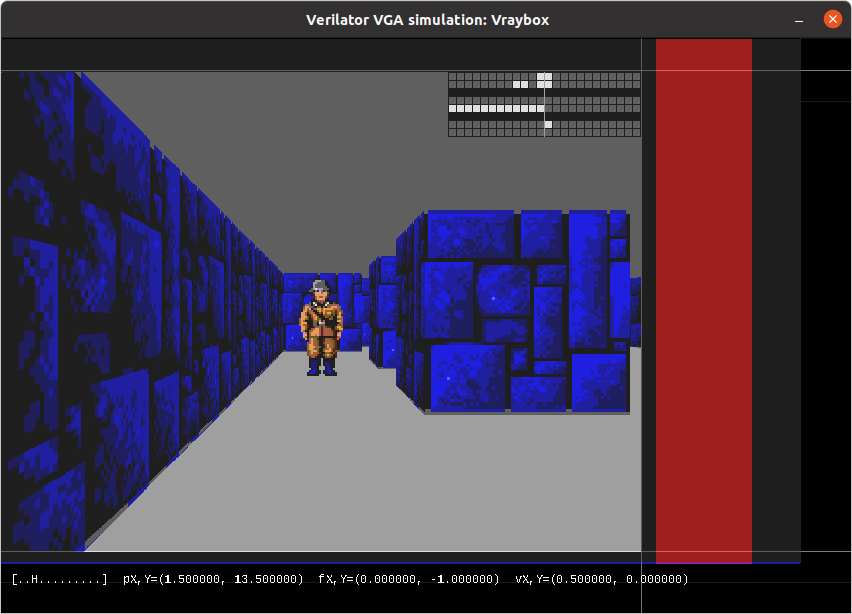

<!--
# SPDX-FileCopyrightText: 2023 Anton Maurovic <anton@maurovic.com>
#
# Licensed under the Apache License, Version 2.0 (the "License");
# you may not use this file except in compliance with the License.
# You may obtain a copy of the License at
#
#      http://www.apache.org/licenses/LICENSE-2.0
#
# Unless required by applicable law or agreed to in writing, software
# distributed under the License is distributed on an "AS IS" BASIS,
# WITHOUT WARRANTIES OR CONDITIONS OF ANY KIND, either express or implied.
# See the License for the specific language governing permissions and
# limitations under the License.
# SPDX-License-Identifier: Apache-2.0
-->

[](https://opensource.org/licenses/Apache-2.0)

# Raybox

This isn't anything yet, but I hope it will be a Verilog-based ray casting VGA
renderer (i.e. "Wolf3D-style" game) soon.

# License

This repo is licensed with [Apache 2.0](LICENSE).

# Hardware

**SCHEMATIC TBD**

Key parts:
*   25.175MHz clock source (though 25.000MHz is good enough).
*   VGA connector: HSYNC and VSYNC via 100&ohm; resistors and R, G, B each via 270&ohm; resistors
    (assuming 3.3V outputs rather than 5V).

# Visual simulation with Verilator

Make sure SDL2 dev packages are installed:
```bash
sudo apt-get update
sudo apt install libsdl2-dev libsdl2-ttf-dev
```

Then hopefully you can run the following and it will build and run the simulator,
popping up a window that shows the game in action.
```bash
make clean sim
```

You can also simulate with various init states, too:
```bash
# Each of these builds and simulates, with all unassigned bits starting at...
make clean sim          # ...0
make clean sim_ones     # ...1
make clean sim_seed     # ...predictable random values based on SEED (set in Makefile or overridden via command-line)
make clean sim_random   # ...unpredictable random values each time. 
```

**Reset** is not asserted automatically at the start of simulation.

## Virtual VGA display



**NOTES** about what you see in the screenshot above:
*   The background is grey and not black because the region that got rendered
    between SDL refreshes gets its lower bits set to visually show what's being updated
    each time. To toggle this, use the <kbd>H</kbd> key.
*   Regions outside the main display area are typically called "overscan" and allow us
    to visualise the "front porch", "sync", and "back porch" signals for each of
    HSYNC (red) and VSYNC (blue).
*   Regions even further outside this (seen as black to the right
    and at the bottom) should not get any video signal crossing into them, except
    maybe during the simulator's initial attempt to lock on to the video signal.
    Anything that DOES make it into this region should decay back to black after a short while.
*   Faint horizontal and vertical lines are showing what a VGA monitor would probably sense
    as the actual exact visible area of the display.


## Simulator Hotkeys

**Simulation controls**: Key presses that change the state of the simulator...

| Key           | Function |
|---------------|----------|
| Space         | Pause simulator |
| H             | Toggle refresh highlight |
| Q or Escape   | Quit     |
| V             | Toggle VSYNC logging |
| X             | Turn on eXamine mode: Pause simulator if last frame had any tone generation |
| S             | Step-examine: Unpause, but with examine mode on again |
| F             | NOT IMPLEMENTED: Step by 1 full frame |
| + (Keypad)    | Increase refresh period by 1000 cycles |
| - (Keypad)    | Decrease refresh period by 1000 cycles |
| 1             | Refresh after every pixel (VERY slow) |
| 2             | Refresh after every line |
| 3             | Refresh after every 10 lines |
| 4             | Refresh after every 80 lines |
| 5             | Refresh exactly on every frame |
| 6             | Refresh exactly every 3 frames |
| 9             | Refresh after every 100 pixels (better for observing repaint within frames) |

**Examine mode** is currently programmed to help observe what happens with tone generation:
1.  Hit X to turn on examine mode.
2.  As soon as a frame completes that included the speaker being turned on, go into PAUSE.
3.  You can either just resume with <kbd>Space</kbd>, or step through each subsequent examine trigger with S.

**Signal controls**: Key state directly drives a signal of the device being simulated:

| Key           | Function |
|---------------|----------|
| R             | Reset    |
| Tab           | Render map overlay |
| F1..F8        | Assert debug signal 1 to 8 |


**Debug signals** (through function keys F1 to F8) depend on the project being simulated.
At this time, they control the individual bits (F1 is MSB, F8 is LSB) of the `debug_set_height` input.
This input gets sent to the internal `tracer` module, and it uses this to write the desired
debug height value to the `trace_buffer`. Note that this happens during VBLANK only.


# Contents

*   [`assets/`](./assets/): `.hex` files that hold test data (game map, and fake trace buffer data).
*   [`de0-nano/`](./de0-nano/): Files to target Terasic DE0-Nano board (Altera Cyclone IV FPGA) in Quartus.
*   [`src/`](./src/): Verilog source for the project.
*   [`sim/`](./sim/): C++ code for Verilator-driven SDL-based VGA simulation.

# Requirements

**TBC!**

Not all of these are necessarily required together. Some are just for different
types of tests:

*   Icarus Verilog (iverilog)
*   Python 3.8+, [cocotb](https://docs.cocotb.org/en/stable/install.html) 1.7.2+, [pytest](https://docs.pytest.org/en/7.1.x/getting-started.html)
*   Verilator + SDL2

Installing pytest 7.1.x (which cocotb uses to improve its assertions output):
```bash
pip install --upgrade pytest
```
